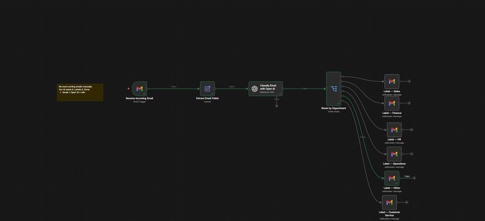

# AI Powered Email Classifier
**Tools:** n8n | OpenAI | Gmail
**Type:** AI Automation Workflow
**Industry:** Business Operations

## Project Overview
Built an intelligent email routing system that 
uses OpenAI to automatically classify and label 
incoming emails by department — eliminating 
manual email sorting completely.

"No more sorting emails manually.
Our AI reads it. Labels it. Done.
Gmail × Open AI × n8n"

## Workflow Architecture
Receive Incoming Email (Gmail Trigger)
→ Extract Email Fields
→ Classify Email with OpenAI (Response Text)
→ Route by Department (Rules)
→ Label by Department in Gmail

## Department Classifications
-  Label — Sales
-  Label — Finance
-  Label — HR
-  Label — Operations
-  Label — Customer Service
-  Label — Other

## How It Works
1. Gmail trigger fires when new email arrives
2. Email fields extracted — subject, body, sender
3. OpenAI analyses email content and classifies
   it into the correct department
4. Router directs email to correct label branch
5. Gmail label applied automatically
6. Zero manual sorting required

## Business Impact
- 100% automated email classification
- Zero manual sorting needed
- Emails routed to correct department instantly
- Scales to handle unlimited email volume
- Reduces response time across all departments

## Skills Demonstrated
- n8n workflow design
- OpenAI API integration
- Gmail API integration
- AI prompt engineering
- Conditional routing logic
- Business process automation
- Natural language processing

## Workflow Preview

